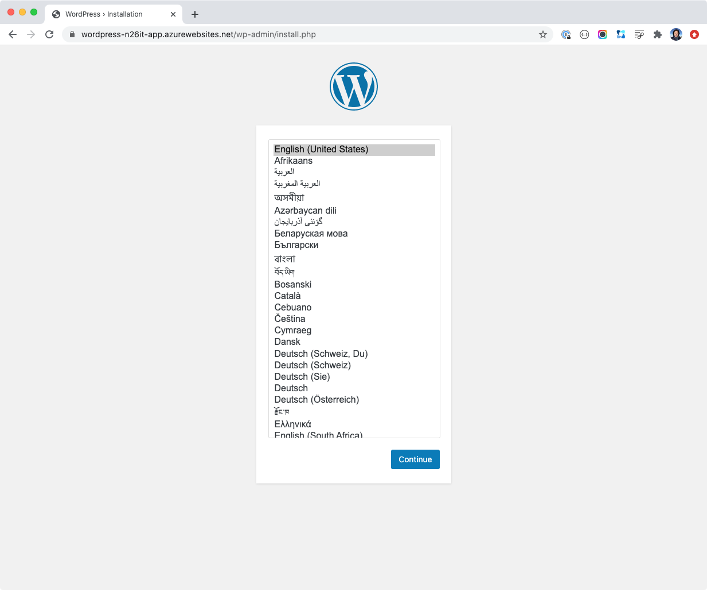
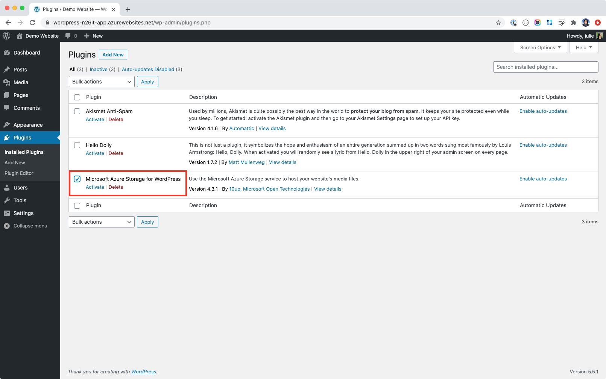
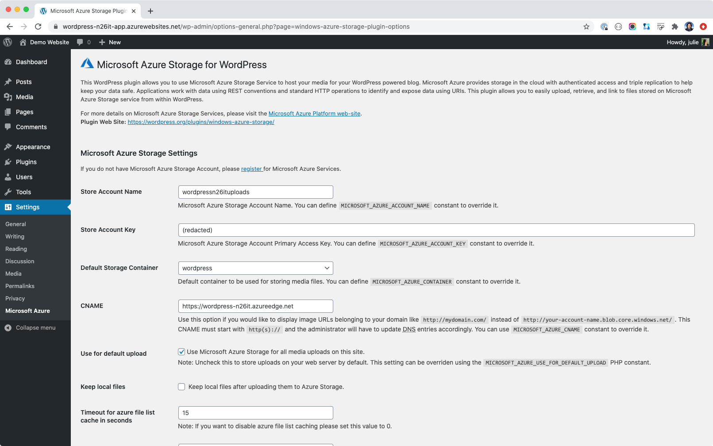

# Wordpress on Azure

[?branchName=main)](https://dev.azure.com/julie-msft/public-demos/_build/latest?definitionId=18&branchName=main)

A Reference Architecture and Demo for Wordpress on Azure - at cloud native scale

## Architecture

Cloud Native applications separate state from their application, which means your media files should _not_ be on what the app thinks is a file system. That means **_there is no uploads folder_**. Instead we will use "Storage as a Service" with Azure Blob Storage.


### Microsoft Azure Storage for WordPress Plugin 

Using the [Microsoft Azure Storage for WordPress](https://wordpress.org/plugins/windows-azure-storage/#installation) plugin, we can implement this architecture with minimal effort. No code require, just plugin installation and configuration.

### Disadvantages of using File System

Out of the box, Wordpress puts uploaded files into `wp-content/uploads`, on the file system, which fine for testing and small webistes. However, file systems do not scale infinitely. You can mount additional storage, for example file shares and with path mappings to avoid architecture and software changes.

- **Performance**  
  However this only hides the underlying problem - file share performance issues, most commonly IO and latency. Increasing disk size and swapping spinning disks for SSD does not scale infinitely.

- **Site Backups**  
  When your media files sit on the file system, how do you plan on backing up something that massive? You need to separate your wordpress code, your customizations, e.g. themes, which can be version controlled. Backups can also become bloated, affecting your Recovery Time Objective (RTO) in event of failure.

### Advantages of Storage as a Service

There is no file system. Instead the application interfaces with an API over HTTP, with the many advantages, including:

- **Infinite Scale**  
  HTTP is cloud scale and web applications have tried and true patterns for handling large scale workloads. For example, if you want to upload a multi Gigabyte video, with HTTP APIs, you can split the data into smaller chunks using multiple HTTP calls that let's you recover from failure, pause uploads and more. Can your file system do that? 

- **Focus on your app, not infrastructure**  
  Like any managed service, Blob Storage does one thing and does it well. Why worry about backups, when you can get redundency out of the box?

and much more! 

# Demo - How to Use

### Why Docker?

Before we start, let's be clear that this reference architecture uses [Official Wordpress Docker Image](https://hub.docker.com/_/wordpress) in a container for convenience. You can also use the [App Service PHP runtime](https://docs.microsoft.com/en-us/azure/app-service/quickstart-php?pivots=platform-linux#push-to-azure-from-git). For this demo, we want to focus on architecure, not managing PHP files.


So our [`Dockerfile`](./Dockerfile) is short and simple:

```docker
FROM wordpress:5.5

# PHP Configuration, e.g. max upload size, etc.
COPY ./uploads.ini /usr/local/etc/php/conf.d/uploads.ini

# Pre-install Azure Storage Plugin
COPY ./wp-plugins/windows-azure-storage /var/www/html/wp-content/plugins/windows-azure-storage
```

#### Mounting Themes and Plugins

Per [official documentation on Docker Hub](https://hub.docker.com/_/wordpress), we can customize the docker image like so:

- Themes go in a subdirectory in `/var/www/html/wp-content/themes/`
- Plugins go in a subdirectory in `/var/www/html/wp-content/plugins/`


## Step 1 - Create Azure Infrastructure with Terraform

For purpose of this demo, you will create the infrastructure locally from your machine.

#### Prerequisites

- [Azure CLI](https://docs.microsoft.com/en-us/cli/azure/install-azure-cli?view=azure-cli-latest)   
- [Terraform CLI](https://terraform.io)

### Login to Azure

You need an Azure Subscription with at least [Contributor](https://docs.microsoft.com/en-us/cli/azure/install-azure-cli?view=azure-cli-latest) role in order to create the Azure resources.

If you do not have an active session, login and select your subscriptoin

```
az login
az account set --subscription <SUBSCRIPTION_ID>
```

### Run Terraform

Demo is already preconfigured. Note that the Infrastructure as Code will add a random string into your resource names, for example `n26it` in the example output below. This is necessary because certain Azure Resource Names, e.g. storage accounts and contianer registries need to be globally unique.

Run:

```
terraform init
terraform plan
terraform apply
```

It may take several minutes to create all the infrastructure. Once it's done, you will see an output similar to this:

```
app_service = {
  "hostname" = "wordpress-n26it-app.azurewebsites.net"
  "name" = "wordpress-n26it-app"  
  "site_config" = {
    "always_on" = true
    "app_command_line" = ""
    "cors" = [
      {
        "allowed_origins" = []
        "support_credentials" = false
      },
    ]
    "ftps_state" = "Disabled"
    "linux_fx_version" = "DOCKER|onazureio/wordpress:5.5"
    "min_tls_version" = "1.2"
    "scm_type" = "None"
  }
}
resource_group = {
  "id" = "/subscriptions/<SUBSCRIPTION_ID>/resourceGroups/wordpress-n26it-rg"
  "location" = "northeurope"
  "name" = "wordpress-n26it-rg"
}
resource_group_id = /subscriptions/<SUBSCRIPTION_ID>/resourceGroups/wordpress-n26it-rg
uploads_cdn_enpoint = https://wordpress-n26it.azureedge.net
uploads_storage_account = {
  "location" = "northeurope"
  "name" = "wordpressn26ituploads"
}
```


## Step 2 - Configure Wordpress App (in Browser)

1. Open your wordpress URL, e.g. `http://wordpress-n26it-app.azurewebsites.net"` **immediately** in your browser for security reasons.  
   . 
2. Select your language
3. Create the administrator account, configure website title, etc.
4. Confirm
5. Finally Login with the credentials you just created in step 3  

## Step 3 - Configure Azure Storage Plugin

The [Microsoft Azure Storage for WordPress](https://wordpress.org/plugins/windows-azure-storage/#installation) plugin is pre-installed, but you must activate it.

1. **Activate the Plugin**  
  Go to "Plugins" > "Installed Plugins", check the box _and_ click the "Activate" link  
   
1. **Configure the Plugin**  
   Go to "Settings" > "Microsoft Azure"  
   
   
   
Configure the following

| Property | Example |
|:--|:--|
| Storage Account Name | `wordpressn26itstatic` |
| Storage Account Access Key | redacted |
| Blob Storage Continer Name | `wordpress`  |
| CDN for Azure Storage Account | `https://wordpress-n26it.azureedge.net` |
|  "Use for default upload" | click the checkbox |

Scroll down and click the "Save Changes" button.

## Step 4 - Upload and Test

To test the setup, upload an image to your blog post and examine the URL. It should look something like this:

```
https://wordpress-n26it.azureedge.net/wordpress/2020/09/my-image-1024x730.png
```

And notice that wordpress even generated a thumbnail of size 1024x730 for me.
